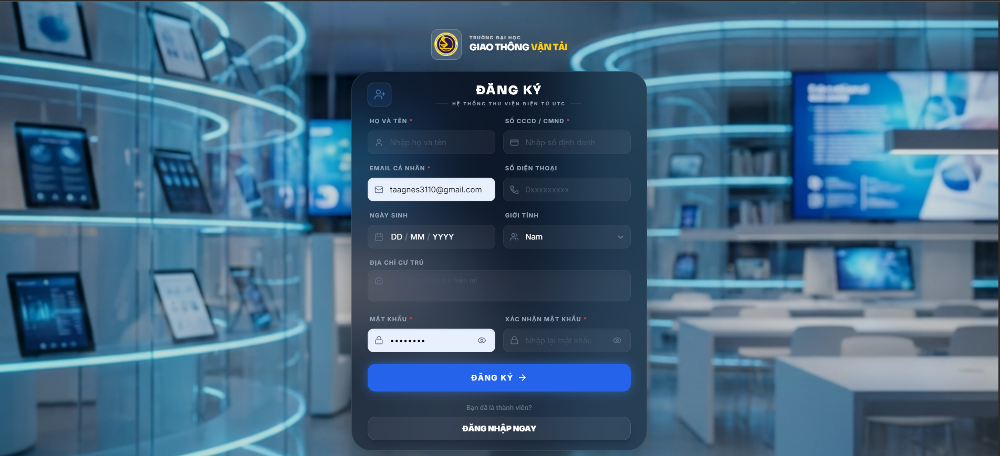
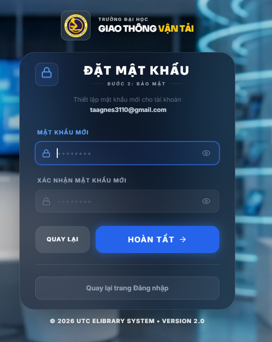
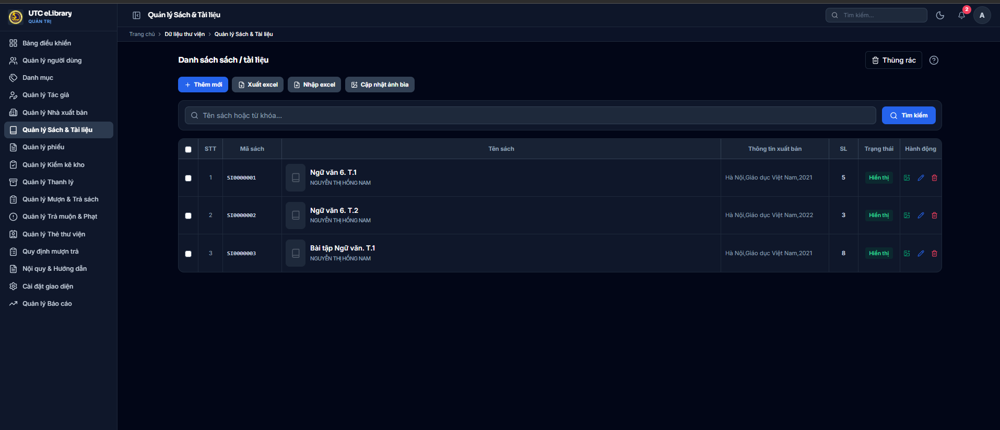
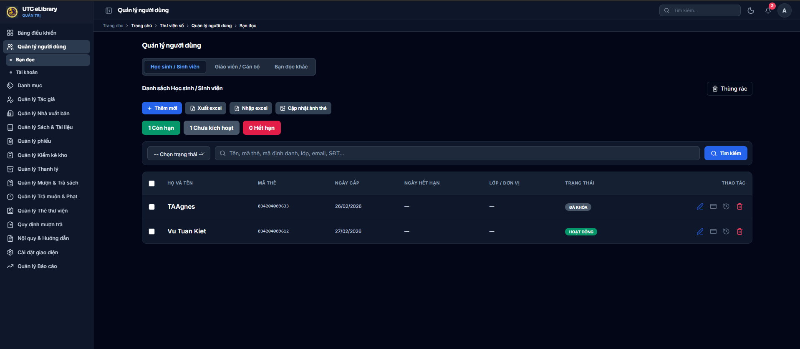
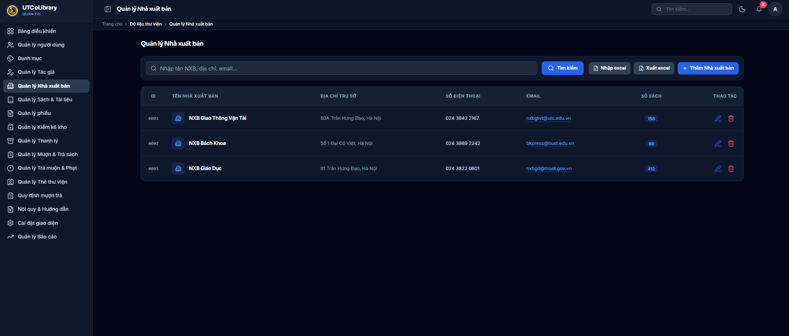
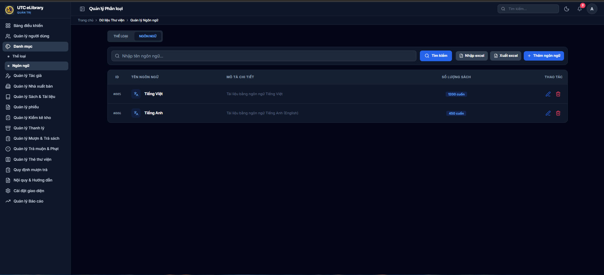
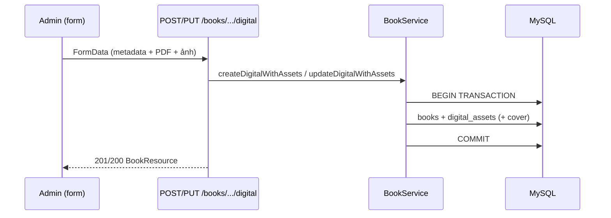
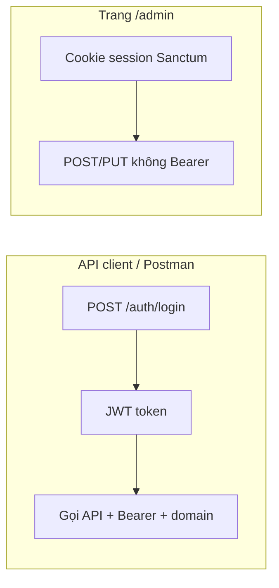
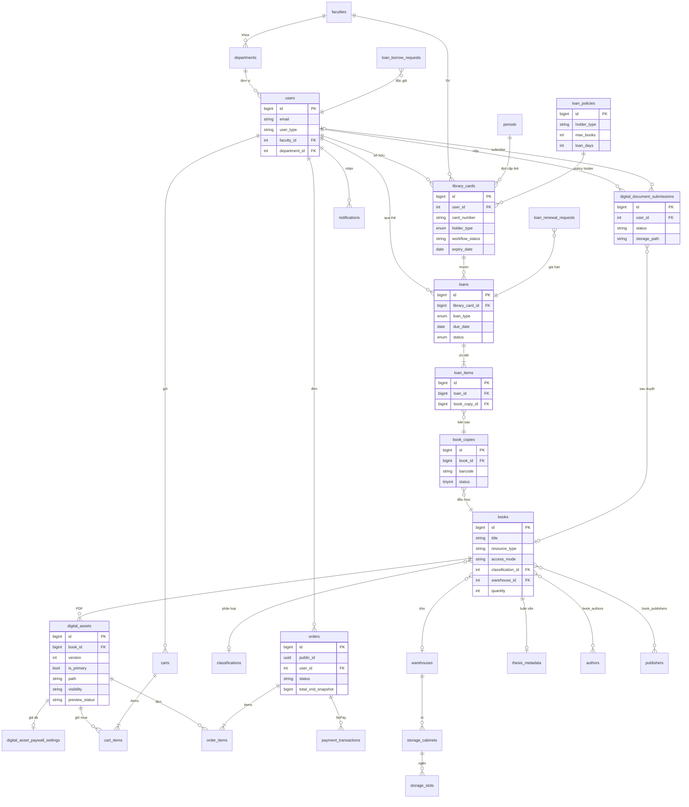

# UTC eLibrary

<p align="center">
  <strong>Hệ thống quản lý thư viện số — Đại học Giao thông Vận tải (UTC)</strong><br>
  Laravel 12 · Vue 3 (Inertia) · MySQL · Redis
</p>

<p align="center">
  
</p>

---

## Mục lục

1. [Tổng quan](#tổng-quan)
2. [Tính năng](#tính-năng)
3. [Ảnh minh họa & sơ đồ](#ảnh-minh-họa--sơ-đồ)
4. [Cài đặt local](#cài-đặt-local)
5. [Tài khoản demo](#tài-khoản-demo)
6. [Cấu trúc thư mục](#cấu-trúc-thư-mục)
7. [API & Postman](#api--postman)
8. [ERD cơ sở dữ liệu](#erd-cơ-sở-dữ-liệu)
9. [Nghiệp vụ UTC (tóm tắt)](#nghiệp-vụ-utc-tóm-tắt)
10. [Deploy EC2 (Docker)](#deploy-ec2-docker)
11. [CI/CD](#cicd)
12. [Biến môi trường](#biến-môi-trường)
13. [Kiểm tra chất lượng](#kiểm-tra-chất-lượng)
14. [Ghi chú bảo mật](#ghi-chú-bảo-mật)

---

## Tổng quan

UTC eLibrary phục vụ:

| Đối tượng | Kênh | Mô tả |
|-----------|------|--------|
| **Độc giả** | Web reader (`/`) | Tra cứu, mượn/trả, thẻ, tài liệu số, thanh toán PDF |
| **Thủ thư / Admin** | Web admin (`/admin`) | Quản lý sách, kho, user, phiếu mượn, duyệt hồ sơ |
| **Client bên thứ ba** | REST `/api/v1` | JWT + header `domain` |

**Stack:** PHP 8.2+, Laravel 12, Vue 3 + Inertia, Vite, MySQL 8, Redis (cache/queue), Sanctum (session SPA), JWT (API).

---

## Tính năng

### Độc giả
- Tra cứu sách in & tài liệu số (đồ án, luận văn)
- Đăng ký / đăng nhập OTP, quên mật khẩu
- Làm thẻ thư viện (sinh viên, giảng viên, khách)
- Gửi yêu cầu mượn, xem phiếu mượn, gia hạn
- Nộp đồ án/luận văn để duyệt
- Giỏ mua quyền tải PDF, thanh toán SePay
- Thông báo trong app

### Admin / thủ thư
- CRUD sách in, **tài liệu số** (upload PDF atomic)
- Kho, phân loại, tủ/kệ, chính sách mượn (`loan_policies`)
- Phiếu mượn/trả, duyệt yêu cầu mượn/gia hạn
- Quản lý thẻ, user, RBAC (Spatie)
- Duyệt submission tài liệu số
- Tin tức, cấu hình thư viện & giá paywall

---

## Ảnh minh họa & sơ đồ

### Vai trò

<p align="center">
  
</p>

### Luồng mượn sách in

<p align="center">
  
</p>

### Giao diện (screenshot)

<table>
  <tr>
    <td align="center"><strong>Đăng nhập</strong><br></td>
    <td align="center"><strong>Đăng ký</strong><br></td>
    <td align="center"><strong>Xác minh OTP</strong><br></td>
  </tr>
  <tr>
    <td align="center"><strong>Quên mật khẩu</strong><br></td>
    <td align="center"><strong>Email OTP</strong><br></td>
    <td align="center"><strong>Đặt lại mật khẩu</strong><br></td>
  </tr>
  <tr>
    <td align="center"><strong>Dashboard admin</strong><br></td>
    <td align="center"><strong>Danh mục sách</strong><br></td>
    <td align="center"><strong>Bạn đọc</strong><br></td>
  </tr>
  <tr>
    <td align="center"><strong>Tác giả</strong><br></td>
    <td align="center"><strong>Nhà xuất bản</strong><br></td>
    <td align="center"><strong>Phân loại</strong><br></td>
  </tr>
  <tr>
    <td align="center"><strong>Tài khoản</strong><br></td>
    <td align="center"><strong>Ngôn ngữ</strong><br></td>
    <td align="center"><strong>Hóa đơn / thanh toán</strong><br></td>
  </tr>
</table>

### Luồng tài liệu số (admin)



### Luồng auth (API vs Admin SPA)



> **Lưu ý:** Trang `/admin` **không** dùng JWT trong `localStorage`. Mọi request axios tới `/admin` dùng cookie session (`skipBearerAuth`).

---

## Cài đặt local

### Yêu cầu
- PHP 8.2+, Composer 2
- Node.js 20+, npm
- MySQL 8, Redis (khuyến nghị)
- Extension: `pdo_mysql`, `mbstring`, `openssl`, `gd` hoặc `imagick` (preview PDF)

### Các bước

```bash
git clone https://github.com/TAAgnes3110/UTC-eLibrary.git
cd UTC-eLibrary
composer install
npm install
cp .env.example .env
php artisan key:generate
```

Cấu hình `.env`: `DB_*`, `REDIS_*`, `APP_URL=http://localhost:8000`.

```bash
php artisan migrate --seed
npm run build
```

Chạy song song:

```bash
# Terminal 1
php artisan serve

# Terminal 2
npm run dev
```

Mở: **http://localhost:8000**

| URL | Mô tả |
|-----|--------|
| `/` | Cổng độc giả |
| `/admin` | Quản trị |
| `/api/health` | Health check |
| `/api/v1/...` | REST API |

### Queue & preview PDF (tùy chọn local)

```bash
php artisan queue:work
# Hoặc đồng bộ preview khi dev:
# DIGITAL_PREVIEW_DISPATCH_SYNC=true
```

---

## Tài khoản demo

| Vai trò | Email | Mật khẩu |
|---------|-------|----------|
| Super Admin | `superadmin@utc.edu.vn` | `password` |
| Admin | `admin@utc.edu.vn` | `password` |
| Thủ thư | `librarian@utc.edu.vn` | `password` |
| Sinh viên | `student@st.utc.edu.vn` | `password` |

---

## Cấu trúc thư mục

```
UTC-eLibrary/
├── app/
│   ├── Http/Controllers/Api/    # REST API
│   ├── Services/                # Nghiệp vụ (Loan, Book, DigitalAsset…)
│   └── Models/
├── resources/js/                # Vue 3 + Inertia
├── routes/api.php               # /api/v1
├── database/migrations/
├── scripts/
│   ├── ec2-deploy.sh
│   ├── ec2-prepare-build.sh
│   └── generate-postman-collection.php
├── readme/assets/               # SVG minh họa README
├── UTC-eLibrary.postman_collection.json
├── docker-compose.ec2.yml
└── Dockerfile.ec2
```

**Không commit:** `.env`, `vendor/`, `node_modules/`, `public/build/`, `playwright-report/`, `test-results/`, `dist/`.

---

## API & Postman

- **Base:** `{{BASE_URL}}/api/v1`
- **Header bắt buộc (JWT):** `domain: {{DOMAIN}}` (thường trùng `APP_URL`)
- **Auth:** `Authorization: Bearer {{token}}` sau `POST /api/v1/auth/login`
- **Middleware `init`:** Hầu hết route sau login — ưu tiên session web nếu có cookie, không thì JWT

### File Postman

| File | Mô tả |
|------|--------|
| `UTC-eLibrary.postman_collection.json` | **195+ request**, sinh từ `php artisan route:list` |
| `scripts/generate-postman-collection.php` | Tái sinh collection khi thêm route |

**Cách dùng:**

1. Import collection vào Postman.
2. Biến `BASE_URL` = `http://localhost:8000`, `DOMAIN` giống `BASE_URL`.
3. Chạy **`POST api/v1/auth/login`** (folder `00 — Auth`) → token tự lưu vào `token`.
4. Gọi các folder còn lại (Me, Staff/Books, Loans, …).

**Tài liệu số (staff):**

| Method | Path | Ghi chú |
|--------|------|---------|
| POST | `/books/digital` | Tạo sách + PDF (multipart) |
| POST | `/books/{book}/digital` | Cập nhật + PDF mới (multipart, khuyến nghị) |
| PUT | `/books/{book}/digital` | Tương đương POST |
| POST | `/books/{book}/digital-assets` | Upload PDF phiên bản mới |

### Health

```http
GET /api/health
```

Trả `200` khi DB + cache OK.

---

## ERD cơ sở dữ liệu

Sơ đồ tổng hợp các bảng nghiệp vụ chính (MySQL). Chi tiết cột xem `database/migrations/`.



### Nhóm bảng phụ trợ

| Nhóm | Bảng |
|------|------|
| **RBAC** | `roles`, `permissions`, `model_has_roles`, … (Spatie) |
| **Auth** | `email_otp`, `personal_access_tokens` |
| **Tin tức** | `news_posts`, `news_post_categories`, … |
| **Hệ thống** | `library_settings`, `site_contents`, `jobs`, `cache` |
| **Lưu** | `saved_books`, `user_profile_update_requests` |

---

## Nghiệp vụ UTC (tóm tắt)

### Mượn về nhà
- Chỉ **sinh viên / giảng viên / cán bộ có thẻ UTC hợp lệ** được checkout.
- **Khách / người ngoài:** chỉ đọc tại chỗ — **không** mượn về nhà.

### Trước khi cho mượn (`LoanService`)
1. Thẻ còn hạn, trạng thái được phép.
2. Chưa vượt `loan_policies.max_books`.
3. Không có mượn quá hạn chưa xử lý.
4. Không nợ phạt (nếu có).
5. `book_copies` khả dụng.

### Tài liệu số
- `resource_type = digital`, `access_mode = online_only`.
- PDF lưu disk **private**; preview N trang đầu (job queue).
- Admin tạo/sửa: **một transaction** (`POST/POST /books/.../digital`) — không để bản ghi “shell” không file.

### Mã sách
- Sách in: theo kho / ĐKCB.
- Tài liệu số: `TLS000001`, …

---

## Deploy EC2 (Docker)

Trên server (ví dụ `~/utc-elibrary`):

```bash
cd ~/utc-elibrary
git pull origin main
bash scripts/ec2-deploy.sh
```

Script: pull → `ec2-prepare-build.sh` → `docker compose build app` → `up -d` → `migrate:existing-schema` → clear cache.

### DB import từ backup SQL

Khi bảng đã có nhưng thiếu dòng trong `migrations`:

```bash
docker compose -f docker-compose.ec2.yml exec app php artisan migrate:existing-schema --force
```

### Sau deploy

- **Ctrl+F5** trình duyệt (JS mới trong image).
- Chỉ `git pull` **không đủ** — phải build lại image.

---

## CI/CD

1. GitHub **Secrets:** `EC2_HOST`, `EC2_USER`, `EC2_SSH_KEY` (tùy chọn `EC2_APP_PATH`).
2. Push `main` → workflow **Deploy EC2** chạy `scripts/ec2-deploy.sh`.

File: `.github/workflows/deploy-ec2.yml`

---

## Biến môi trường

### Local (`.env.example`)

| Biến | Mô tả |
|------|--------|
| `APP_URL` | URL gốc |
| `DB_*` | MySQL |
| `REDIS_*` | Cache / queue |
| `SANCTUM_STATEFUL_DOMAINS` | Host SPA (session) |
| `API_ALLOWED_DOMAINS` | Domain cho JWT |
| `DIGITAL_ASSETS_DISK` | `local` hoặc `s3` / R2 |
| `DIGITAL_PREVIEW_DISPATCH_SYNC` | `true` khi dev không chạy queue |

### EC2 (HTTP, ví dụ)

```env
DEPLOY_PROFILE=vps
APP_URL=http://<IP-EC2>
SESSION_SECURE_COOKIE=false
SESSION_DOMAIN=
SANCTUM_STATEFUL_DOMAINS=<IP-EC2>,localhost,127.0.0.1
API_ALLOWED_DOMAINS=http://<IP-EC2>,<IP-EC2>
DIGITAL_PREVIEW_DISPATCH_SYNC=true
QUEUE_CONNECTION=redis
```

**Admin / tài liệu số:** `/admin` dùng cookie session. Lỗi 401 khi Lưu → F5, đăng nhập lại; kiểm tra `SESSION_SECURE_COOKIE=false` trên HTTP.

---

## Kiểm tra chất lượng

```bash
npm run build
php artisan route:list
php artisan test
vendor/bin/pint
```

Tái sinh Postman sau khi đổi route:

```bash
php scripts/generate-postman-collection.php
```

---

## Ghi chú bảo mật

- Không commit `.env`, key, credentials.
- Không log PII / mật khẩu.
- PDF tài liệu số: không lộ URL public khi disk `local`.
- `resource_type`: `textbook` | `reference` | `digital`.

---

<p align="center">
  <sub>Đại học Giao thông Vận tải (UTC) · MIT-compatible OSS components</sub>
</p>
