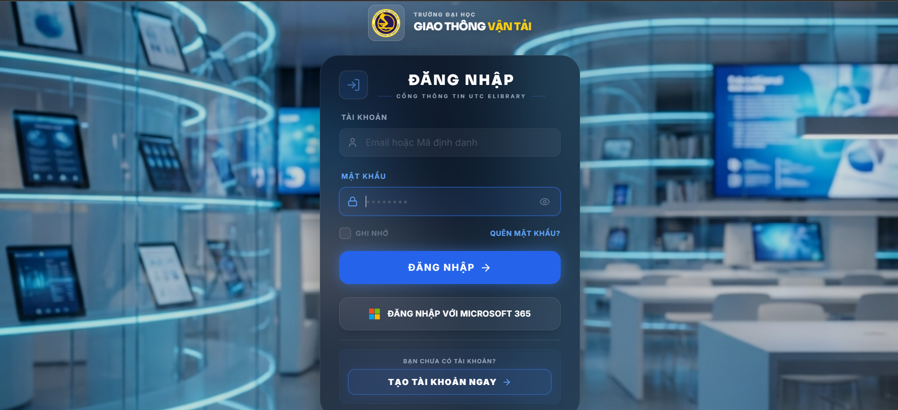
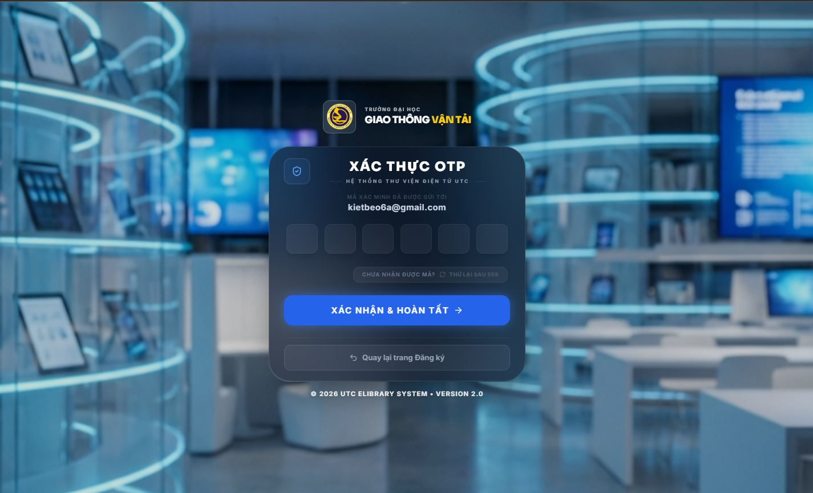
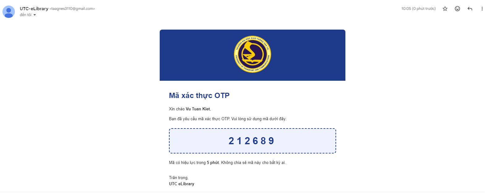
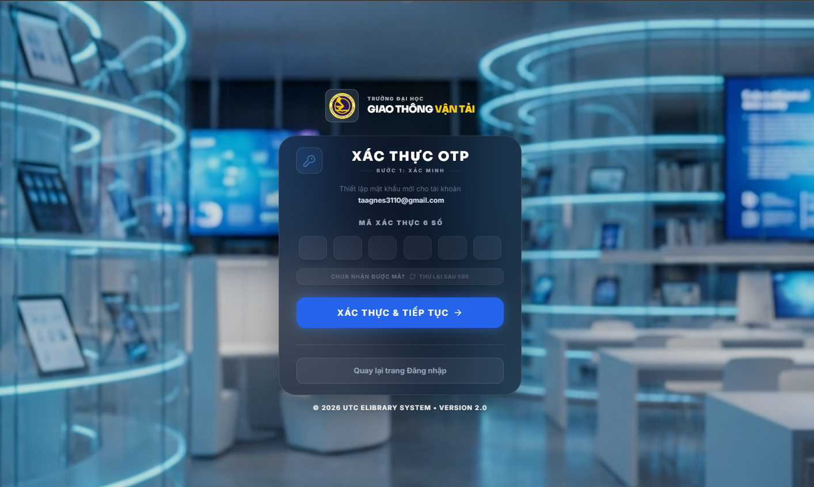
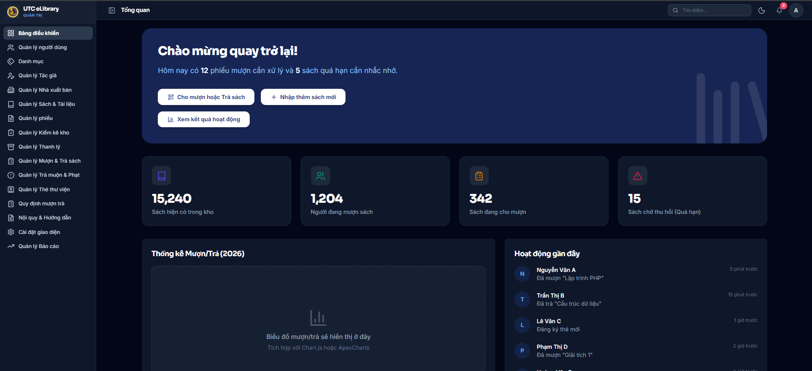
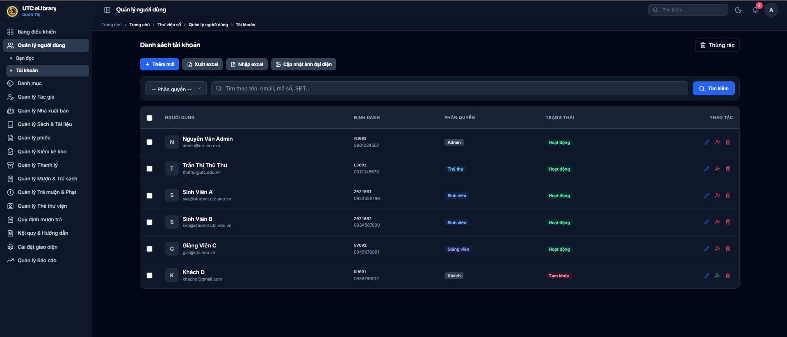
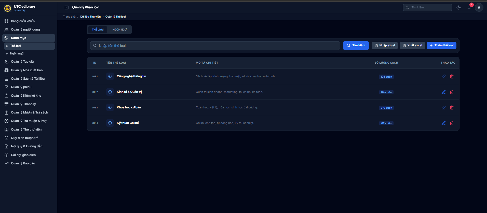
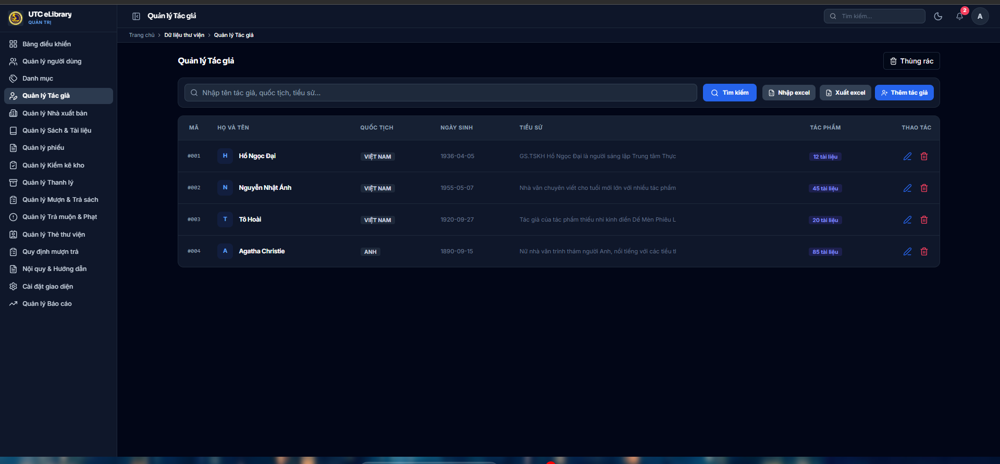
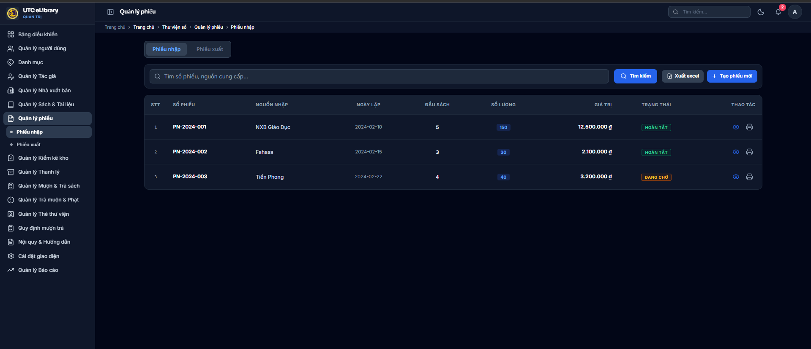

# 📚 UTC-eLibrary

> Hệ thống quản lý thư viện trường **Đại học Giao thông Vận tải (UTC)** — Đồ án Quản lý thư viện.

[](https://laravel.com)
[](https://vuejs.org)
[](https://tailwindcss.com)

---

## 📋 Mục lục

- [Giới thiệu](#-giới-thiệu)
- [Ảnh màn hình](#-ảnh-màn-hình)
- [Chức năng hệ thống](#-chức-năng-hệ-thống)
- [Công nghệ sử dụng](#-công-nghệ-sử-dụng)
- [Cài đặt & Chạy](#-cài-đặt--chạy)
- [Docker](#-docker)
- [Tác giả](#-tác-giả)

---

## ℹ️ Giới thiệu

Dự án **UTC-eLibrary** là Đồ án Quản lý thư viện, xây dựng nhằm quản lý sách, độc giả và quy trình mượn–trả sách một cách hiệu quả và hiện đại.

---

## 🖼️ Ảnh màn hình

Ảnh chụp màn hình đặt trong **`docs/screenshots/`** với đúng tên file (xem danh sách trong [`docs/screenshots/README.txt`](docs/screenshots/README.txt)). Nếu bạn có một thư mục ảnh theo thứ tự, đặt vào `docs/screenshots/incoming/` rồi chạy `copy-screenshots.bat` (Windows) hoặc `copy-screenshots.sh` (Bash) để tự động đặt tên.

### Đăng nhập, Đăng ký & Xác thực OTP

| Màn hình | Mô tả |
|----------|--------|
| Đăng nhập | Trang đăng nhập — tài khoản/mật khẩu, Ghi nhớ, Quên mật khẩu, Đăng nhập Microsoft 365 |
| Đăng ký | Form đăng ký — họ tên, email, CCCD/CMND, SĐT, giới tính, ngày sinh, địa chỉ, mật khẩu |
| Xác thực OTP (đăng ký) | Nhập mã 6 số gửi tới email sau khi đăng ký, có nút gửi lại và quay lại đăng ký |
| Email OTP | Mẫu email gửi mã xác thực OTP từ UTC-eLibrary (hiệu lực 5 phút) |
| Quên mật khẩu | Nhập email đăng ký để nhận mã OTP khôi phục tài khoản |
| Xác thực OTP (đặt lại MK) | Bước xác minh OTP trước khi thiết lập mật khẩu mới |
| Đặt mật khẩu | Bước 2: Thiết lập mật khẩu mới và xác nhận, nút Quay lại / Hoàn tất |

| |
|:--:|
|  |
| *Đăng nhập — Cổng thông tin UTC eLibrary* |

| |
|:--:|
|  |
| *Đăng ký — Hệ thống thư viện điện tử UTC* |

| |
|:--:|
|  |
| *Xác thực OTP sau đăng ký* |

| |
|:--:|
|  |
| *Email gửi mã OTP* |

| |
|:--:|
|  |
| *Quên mật khẩu — Khôi phục tài khoản* |

| |
|:--:|
|  |
| *Xác thực OTP — Bước 1: Xác minh (đặt lại mật khẩu)* |

| |
|:--:|
|  |
| *Đặt mật khẩu — Bước 2: Bảo mật* |

**Tên file gợi ý:** `login.png`, `register.png`, `verify-otp-register.png`, `otp-email.png`, `forgot-password.png`, `verify-otp-reset.png`, `set-password.png`

---

### Trang chủ & Bảng điều khiển

| Màn hình | Mô tả |
|----------|--------|
| Dashboard | Tổng quan: chào mừng, phiếu mượn cần xử lý, thống kê sách/người mượn/sách quá hạn, biểu đồ mượn-trả, hoạt động gần đây |

| |
|:--:|
|  |
| *Bảng điều khiển — Tổng quan UTC eLibrary* |

### Quản lý người dùng

| Màn hình | Mô tả |
|----------|--------|
| Danh sách Bạn đọc | Tab Học sinh/Sinh viên: mã thẻ, ngày cấp/hết hạn, lớp/đơn vị, trạng thái; Thêm mới, Xuất/Nhập excel, Cập nhật ảnh thẻ |
| Danh sách Tài khoản | Danh sách tài khoản theo phân quyền (Admin, Thủ thư, Sinh viên...), trạng thái Hoạt động/Tạm khóa, Thêm mới, Xuất/Nhập excel |

| |
|:--:|
|  |
| *Quản lý người dùng — Danh sách Học sinh / Sinh viên* |

| |
|:--:|
|  |
| *Quản lý người dùng — Danh sách tài khoản* |

### Quản lý Danh mục (Thể loại, Ngôn ngữ)

| Màn hình | Mô tả |
|----------|--------|
| Quản lý Thể loại | Danh sách thể loại: ID, tên, mô tả chi tiết, số lượng sách; Tìm kiếm, Nhập/Xuất excel, Thêm thể loại |
| Quản lý Ngôn ngữ | Danh sách ngôn ngữ: ID, tên ngôn ngữ, mô tả, số lượng sách; Tìm kiếm, Nhập/Xuất excel, Thêm ngôn ngữ |

| |
|:--:|
|  |
| *Quản lý Phân loại — Thể loại* |

| |
|:--:|
|  |
| *Quản lý Phân loại — Ngôn ngữ* |

### Quản lý Tác giả

| Màn hình | Mô tả |
|----------|--------|
| Quản lý Tác giả | Danh sách tác giả: mã, họ tên, quốc tịch, ngày sinh, tiểu sử, số tác phẩm; Tìm kiếm, Nhập/Xuất excel, Thêm tác giả, Thùng rác |

| |
|:--:|
|  |
| *Quản lý Tác giả — Dữ liệu thư viện* |

### Quản lý Nhà xuất bản

| Màn hình | Mô tả |
|----------|--------|
| Quản lý Nhà xuất bản | Danh sách NXB: ID, tên, địa chỉ trụ sở, SĐT, email, số sách; Tìm kiếm, Nhập/Xuất excel, Thêm Nhà xuất bản |

| |
|:--:|
|  |
| *Quản lý Nhà xuất bản — Dữ liệu thư viện* |

### Quản lý Sách & Tài liệu

| Màn hình | Mô tả |
|----------|--------|
| Danh sách sách / tài liệu | STT, mã sách, tên sách (tác giả), thông tin xuất bản, số lượng, trạng thái; Thêm mới, Xuất/Nhập excel, Cập nhật ảnh bìa, Thùng rác |
| Form sách | Thêm/sửa sách, tác giả, NXB, bản in (có thể bổ sung ảnh sau) |

| |
|:--:|
|  |
| *Quản lý Sách & Tài liệu — Danh sách sách / tài liệu* |

### Quản lý phiếu

| Màn hình | Mô tả |
|----------|--------|
| Phiếu nhập | Tab Phiếu nhập: số phiếu, nguồn nhập, ngày lập, đầu sách, số lượng, giá trị, trạng thái; Tạo phiếu mới, Xuất excel |
| Phiếu xuất | Tab Phiếu xuất (phiếu xuất kho) |

| |
|:--:|
|  |
| *Quản lý phiếu — Phiếu nhập* |

### Mượn trả & Báo cáo

| Màn hình        | Mô tả                    |
|-----------------|---------------------------|
| Mượn / Trả      | Giao diện mượn sách, trả sách, gia hạn |
| Thống kê        | Báo cáo mượn trả, tổng quan kho       |

<!--  -->
<!--  -->

> **Cách thêm ảnh:** Đặt file ảnh vào `docs/screenshots/` với đúng tên file (xem gợi ý trong từng mục hoặc `docs/screenshots/README.txt`).

---

## 🌟 Chức năng Hệ thống

### 📚 Quản lý Sách (Tài nguyên)

- **Đa dạng loại tài liệu:** Sách bản cứng và tài liệu số (bản mềm).
- **Nghiệp vụ:** Nhập sách, phân loại khoa học, in nhãn sách, in phích, in sổ quản lý, thanh lý sách cũ/hỏng.

### 👤 Quản lý Độc giả

- Quản lý thông tin độc giả.
- In thẻ thư viện.

### 🔄 Mượn – Trả

- Theo dõi mượn/trả tài liệu.
- Gia hạn, xử lý phạt quá hạn.

### 📊 Báo cáo & Kiểm kê

- Kiểm kê tài sản định kỳ.
- Báo cáo tổng quan sách, đầu sách.
- Thống kê mượn trả theo thời gian (ngày/tháng/năm), theo lớp, nhóm độc giả.

---

## 🛠️ Công nghệ sử dụng

| Thành phần | Công nghệ |
|------------|-----------|
| **Backend** | Laravel 12, PHP 8.x |
| **Frontend** | Vue 3, Inertia.js |
| **Styling** | Tailwind CSS |
| **Database** | MySQL / SQLite |
| **Cache** | Redis (tùy chọn) / Database |
| **Auth** | JWT (API), Session (Web), OAuth (Microsoft) |

### 📱 Responsive & thiết bị di động

Giao diện hỗ trợ **điện thoại, tablet và desktop**:

- **Viewport & theme:** Meta viewport, theme-color theo dark/light, hỗ trợ thêm vào màn hình chính (PWA-style).
- **Safe area:** Padding theo `env(safe-area-inset-*)` cho máy có notch / tai thỏ.
- **Touch:** Các liên kết chính (Tra cứu sách, Đăng nhập, …) có vùng chạm ~44px; nút submit đủ cao.
- **Layout:** Sidebar ẩn trên mobile (menu hamburger), bảng có `overflow-x-auto`, grid chuyển 1 cột trên màn hẹp.
- **Ảnh / media:** `max-width: 100%` trong nội dung để không tràn màn hình.

---

## 🚀 Cài đặt & Chạy

### Yêu cầu

- PHP 8.2+
- Composer, Node.js & npm
- MySQL hoặc SQLite

### Các bước

**1. Clone repository**

```bash
git clone https://github.com/TAAgnes3110/UTC-eLibrary.git
cd UTC-eLibrary
```

**2. Cài đặt dependencies**

```bash
composer install
npm install
```

**3. Cấu hình môi trường**

- Copy `.env.example` thành `.env`
- Cấu hình database và các biến môi trường (xem mục Redis/OAuth trong `.env.example` nếu cần)

**4. Chạy migration và seeder**

```bash
php artisan key:generate
php artisan migrate --seed
```

**Tài khoản mặc định (sau khi chạy seed):**

| Vai trò      | Email                 | Mật khẩu  |
|-------------|------------------------|-----------|
| Admin       | `admin@example.com`    | `password` |
| Thủ thư     | `librarian@example.com`| `password` |
| Người dùng  | `user@example.com`     | `password` |

Chỉ tạo tài khoản nếu chưa tồn tại (theo email). Nên đổi mật khẩu sau lần đăng nhập đầu.

**5. Chạy ứng dụng**

```bash
# Terminal 1: frontend
npm run dev

# Terminal 2: backend
php artisan serve
```

Truy cập: **http://localhost:8000**

---

## 🐳 Docker

Chạy toàn bộ ứng dụng (app + MySQL + Redis) bằng Docker:

```bash
docker compose up -d
docker compose exec app php artisan migrate --seed --force
```

- Ứng dụng: http://localhost:8000  
- MySQL: port 3306  
- Redis: port 6379  

Chi tiết: xem `docker-compose.yml` và `Dockerfile`.

---

## 🌐 Ngrok (truy cập từ bên ngoài)

Để test trên điện thoại, demo từ xa hoặc test OAuth/Webhook:

1. **Cài đặt ngrok** (nếu chưa có):
   - Tải [ngrok](https://ngrok.com/download) (Windows), giải nén và đặt `ngrok.exe` vào thư mục (vd: `C:\ngrok\ngrok.exe`).
   - Hoặc dùng Chocolatey: `choco install ngrok` (chạy CMD/PowerShell **Run as Administrator**).
2. Đăng ký [ngrok.com](https://ngrok.com) và lấy Authtoken.
3. Thêm vào `.env`:
   ```env
   NGROK_AUTHTOKEN=your_ngrok_authtoken_here
   ```
4. Chạy ngrok:
   - **Git Bash / Terminal:** `ngrok http 8000` (chỉ chạy được nếu `ngrok` đã nằm trong PATH).
   - **Nếu báo "command not found":** dùng đường dẫn đầy đủ, ví dụ:
     ```bash
     /c/ngrok/ngrok.exe http 8000
     ```
     (đổi `C:\ngrok\ngrok.exe` theo nơi bạn đặt file; trong Git Bash dùng `/c/ngrok/ngrok.exe`).
   - **Windows CMD:** `start-ngrok.bat` hoặc `ngrok http 8000` (file `start-ngrok.bat` nằm ở thư mục gốc project).
   - **Git Bash:** `./start-ngrok.sh` hoặc `./ngrok.exe http 8000` (nếu đặt `ngrok.exe` trong thư mục project).
   - (Đổi `8000` nếu app chạy ở port khác.)
5. Copy URL ngrok (vd: `https://xxxx.ngrok-free.dev`) và cập nhật trong `.env`:
   ```env
   APP_URL=https://xxxx.ngrok-free.dev
   ```

> ⚠️ Mỗi lần restart ngrok URL thường đổi (trừ gói trả phí). Nhớ cập nhật lại `APP_URL`.

---

## 📁 Tài liệu thêm

- **API:** [docs/API.md](docs/API.md) — Mô tả API v1, endpoint, rate limit.
- **Kiến trúc:** [ARCHITECTURE.md](ARCHITECTURE.md) — REST API, Auth, Cache, Docker, Health.

---

## 👨‍💻 Tác giả

| | |
|---|---|
| **Tác giả** | Vũ Tuấn Kiệt |
| **Bút danh** | TAAgnes |
| **Email** | [taagnes3110@gmail.com](mailto:taagnes3110@gmail.com) |
| **SĐT** | 0936992346 |

---

*Đồ án Quản lý thư viện — Trường Đại học Giao thông Vận tải.*
