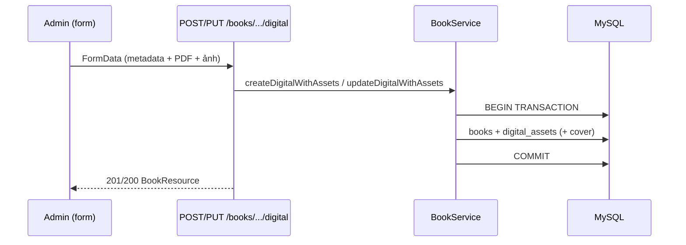
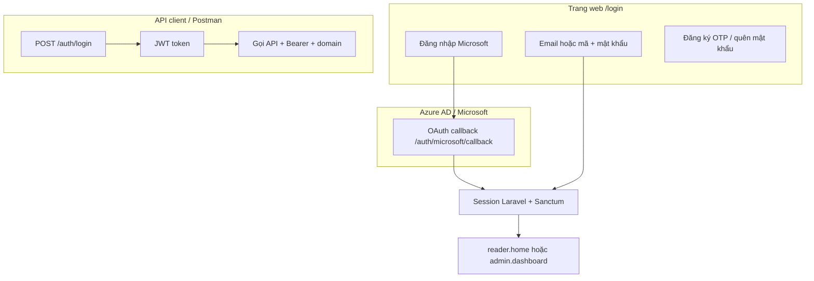
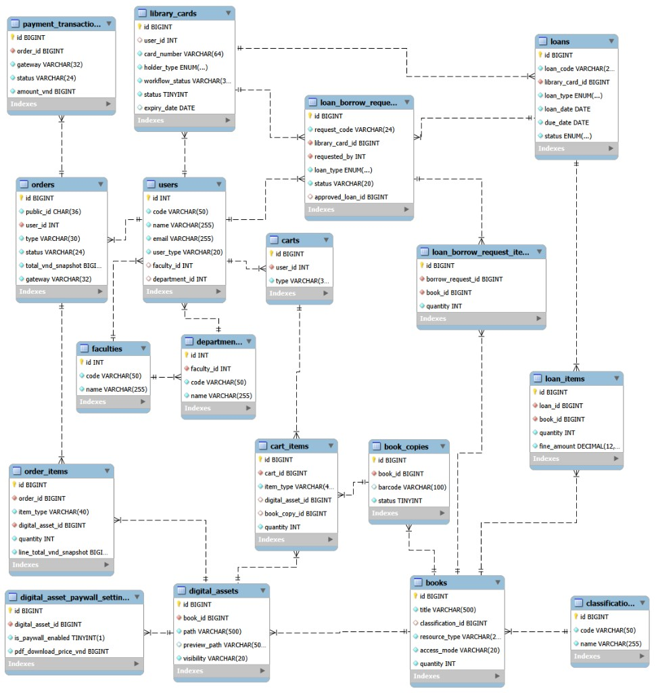

# UTC eLibrary

<p align="center">
  <strong>Hệ thống quản lý thư viện số — Đại học Giao thông Vận tải (UTC)</strong>
</p>

<p align="center">
  
  
  
  
  
  
</p>

<p align="center">
  <strong>Demo production:</strong>
  <code>http://&lt;EC2_PUBLIC_IP&gt;/</code> ·
  <code>https://&lt;your-domain&gt;/</code> ·
  <code>/admin</code>
</p>

<p align="center">
  <sub>Thay <code>&lt;EC2_PUBLIC_IP&gt;</code> và <code>&lt;your-domain&gt;</code> bằng giá trị thật trong <code>.env</code> (không commit).</sub>
</p>

<p align="center">
  
</p>

---

## Mục lục

1. [Tổng quan](#tổng-quan)
2. [Tính năng](#tính-năng)
3. [Ảnh minh họa & sơ đồ](#ảnh-minh-họa--sơ-đồ)
4. [Cài đặt local](#cài-đặt-local)
5. [Tài khoản demo](#tài-khoản-demo)
6. [Đăng nhập & xác thực](#đăng-nhập--xác-thực)
7. [Nhập/xuất Excel (admin)](#nhậpxuất-excel-admin)
8. [Cấu trúc thư mục](#cấu-trúc-thư-mục)
9. [API & Postman](#api--postman)
10. [ERD cơ sở dữ liệu](#erd-cơ-sở-dữ-liệu)
11. [Nghiệp vụ UTC (tóm tắt)](#nghiệp-vụ-utc-tóm-tắt)
12. [AI / ECC (Cursor)](#ai--ecc-cursor)
13. [Deploy EC2 (Docker)](#deploy-ec2-docker)
14. [CI/CD](#cicd)
15. [Biến môi trường](#biến-môi-trường)
16. [Kiểm tra chất lượng](#kiểm-tra-chất-lượng)
17. [Ghi chú bảo mật](#ghi-chú-bảo-mật)
18. [Xử lý sự cố deploy](#xử-lý-sự-cố-deploy)

---

## Tổng quan

UTC eLibrary phục vụ:

| Đối tượng | Kênh | Mô tả |
|-----------|------|--------|
| **Độc giả** | Web reader (`/`) | Tra cứu, mượn/trả, thẻ, tài liệu số, thanh toán PDF |
| **Thủ thư / Admin** | Web admin (`/admin`) | Quản lý sách, kho, user, phiếu mượn, duyệt hồ sơ |
| **Client bên thứ ba** | REST `/api/v1` | JWT + header `domain` |

**Stack:** PHP 8.2+, Laravel 12, Vue 3 + Inertia, Vite, MySQL 8, Redis (cache/queue), Sanctum (session SPA), JWT (API).

---

## Tính năng

### Độc giả
- Tra cứu sách in & tài liệu số (đồ án, luận văn), xem trước PDF, tải sau thanh toán
- **Đăng nhập:** email/mã định danh + mật khẩu, **Microsoft** (OAuth Azure), hoặc đăng ký OTP
- Làm thẻ thư viện (sinh viên, giảng viên, khách)
- Gửi yêu cầu mượn, xem phiếu mượn, gia hạn
- Nộp đồ án/luận văn để duyệt
- Giỏ mượn sách in + giỏ mua quyền tải PDF, thanh toán SePay (VietQR)
- Thông báo trong app (poll UI)

### Admin / thủ thư
- CRUD sách in, **tài liệu số** (upload PDF atomic, preview queue)
- **Nhập/xuất Excel:** sách (mẫu 5 sheet), kho, phân loại; xuất phiếu mượn, thẻ, user
- Kho, tủ/kệ, phân loại — mã kho có thể để trống để hệ thống tự sinh
- Phiếu mượn/trả, duyệt yêu cầu mượn/gia hạn
- Quản lý thẻ, user, RBAC (Spatie)
- Duyệt submission tài liệu số, thùng rác (soft delete) trên nhiều module
- Tin tức, cấu hình thư viện & giá paywall

---

## Ảnh minh họa & sơ đồ

### Vai trò

<p align="center">
  
</p>

### Luồng mượn sách in

<p align="center">
  
</p>

### Giao diện (screenshot môi trường production)

Ảnh **full-page**, viewport **máy tính 1920×1080** (Chrome desktop, dark mode) — mỗi trang **một hàng**, `width="100%"`. Tái chụp: `node scripts/capture-readme-screenshots.mjs`.

---

#### Luồng trọng tâm — Mượn sách & phiếu mượn

**Quy định mượn sách** — `/quy-dinh/muon-sach`

<p align="center"></p>

**Làm thẻ thư viện** — `/dich-vu/cap-the-thu-vien`

<p align="center"></p>

**Phiếu mượn của tôi (độc giả)** — `/dich-vu/phieu-muon`

<p align="center"></p>

**Duyệt yêu cầu mượn (thủ thư)** — `/admin/loans/borrow-requests`

<p align="center"></p>

**Lập phiếu mượn tại quầy** — `/admin/loans/create`

<p align="center"></p>

**Danh sách phiếu mượn** — `/admin/loans`

<p align="center"></p>

**Chi tiết phiếu mượn** — `/admin/loans/{id}`

<p align="center"></p>

**Gia hạn mượn (duyệt)** — `/admin/loans/renewal-requests`

<p align="center"></p>

---

#### Luồng trọng tâm — Thanh toán & tài liệu số

**Tra cứu & chi tiết sách** — `/tra-cuu-sach`, `/tra-cuu-sach/{id}`

<p align="center"></p>

<p align="center"></p>

**Giỏ sách (mượn in)** — `/dich-vu/gio-sach` *(đã thêm sách từ tra cứu trước khi chụp)*

<p align="center"></p>

**Giỏ mua tài liệu số** — `/dich-vu/gio-sach?tab=purchase`

<p align="center"></p>

**Thanh toán SePay — bước cuối (QR VietQR)** — `/dich-vu/thanh-toan` *(bước 3/3 sau «Đặt hàng»)*

<p align="center"></p>

**Đơn hàng của tôi** — `/dich-vu/don-hang-cua-toi`

<p align="center"></p>

**Cấu hình giá paywall (admin)** — `/admin/library-settings/pricing`

<p align="center"></p>

**Đồ án / luận văn (admin)** — `/admin/books/digital`

<p align="center"></p>

**Duyệt bài nộp tài liệu số** — `/admin/books/digital/submissions`

<p align="center"></p>

**Dịch vụ tài liệu số (độc giả)** — `/dich-vu/tai-lieu-so`

<p align="center"></p>

---

#### Thẻ thư viện & quản trị khác

**Thẻ đã cấp** — `/admin/library-cards`

<p align="center"></p>

**Hồ sơ làm thẻ (duyệt)** — `/admin/library-cards/requests`

<p align="center"></p>

**Sách in (danh mục)** — `/admin/books/printed`

<p align="center"></p>

**Dashboard tổng quan** — `/admin`

<p align="center"></p>

---

<details>
<summary><strong>Xem thêm — Auth & trang giới thiệu</strong></summary>

<br>

**Trang chủ** — `/`

<p align="center"></p>

**Đăng nhập** — `/login` (email/mật khẩu + **Đăng nhập với Microsoft**)

<p align="center"></p>

**Đăng ký** — `/register`

<p align="center"></p>

</details>

> Demo: [Tài khoản demo](#tài-khoản-demo) (`student@…` cho luồng mượn/TT, `admin@…` cho admin). Sau deploy: **Ctrl+F5**.

### Luồng tài liệu số (admin)



### Luồng auth (web reader + API)



> **Microsoft:** hỗ trợ mọi tài khoản Microsoft (`AZURE_TENANT_ID=common`). User mới qua Microsoft được gán `MEMBER`; tài khoản staff đã có trong DB vẫn vào `/admin` theo role cũ. Chi tiết: [Đăng nhập & xác thực](#đăng-nhập--xác-thực).

> **Admin SPA:** Trang `/admin` **không** dùng JWT trong `localStorage`. Request axios tới `/admin` dùng cookie session (`skipBearerAuth`).

---

## Cài đặt local

### Yêu cầu
- PHP 8.2+, Composer 2
- Node.js 20+, npm
- MySQL 8, Redis (khuyến nghị)
- Extension: `pdo_mysql`, `mbstring`, `openssl`, `gd` hoặc `imagick` (preview PDF)

### Các bước

```bash
git clone https://github.com/TAAgnes3110/UTC-eLibrary.git
cd UTC-eLibrary
composer install
npm install
cp .env.example .env
php artisan key:generate
```

Cấu hình `.env`: `DB_*`, `REDIS_*`, `APP_URL=http://localhost:8000`.

```bash
php artisan migrate --seed
npm run build
```

Chạy song song:

```bash
# Terminal 1
php artisan serve

# Terminal 2
npm run dev
```

Mở: **http://localhost:8000**

| URL | Mô tả |
|-----|--------|
| `/` | Cổng độc giả |
| `/login` | Đăng nhập (email/mật khẩu + Microsoft) |
| `/admin` | Quản trị |
| `/api/health` | Health check |
| `/api/v1/...` | REST API |

### Docker (local, tùy chọn)

```bash
cp .env.docker.example .env
# Sửa APP_URL, DB_PASSWORD trong .env nếu cần
docker compose up -d --build
docker compose exec app php artisan key:generate
docker compose exec app php artisan migrate --seed
```

Mở theo `APP_URL` / `APP_PORT` trong `.env` (mặc định port 80).

### Microsoft OAuth (tùy chọn)

Laravel dùng **OAuth server-side** (Socialite + `client_secret`) — cấu hình Azure phải khớp **cả Portal lẫn `.env`**.

#### Bước 1 — Azure Portal

[App registrations](https://portal.azure.com/#view/Microsoft_AAD_RegisteredApps/ApplicationsListBlade) → app **UTC-eLibrary** (hoặc tạo mới).

| Mục | Giá trị bắt buộc |
|-----|------------------|
| **Supported account types** | **Accounts in any organizational directory and personal Microsoft accounts** |
| **Redirect URI — platform Web** | `https://<domain>/auth/microsoft/callback` |
| **Redirect URI — SPA** | **Để trống** (không đặt callback ở SPA) |
| **Client secret** | Tạo trong **Certificates & secrets** (copy ngay — chỉ hiện 1 lần) |
| **API permissions** | Microsoft Graph → delegated: `openid`, `profile`, `email`, `User.Read` → Grant admin consent |

**Manifest kiểm tra nhanh** (Azure → **Manifest**):

```json
"signInAudience": "AzureADandPersonalMicrosoftAccount",
"web": {
  "redirectUris": [
    "https://kiet.mmoall.com/auth/microsoft/callback"
  ]
},
"spa": {
  "redirectUris": []
}
```

| Sai (hay gặp) | Đúng |
|---------------|------|
| `web.redirectUris: []` + URI nằm trong `spa` | URI chỉ nằm trong **`web`** |
| `signInAudience: AzureADMultipleOrgs` | `AzureADandPersonalMicrosoftAccount` |
| `AZURE_CLIENT_ID` khác `appId` trên Portal | Trùng `appId` (Application ID) |

> **`AZURE_TENANT_ID=common`** chỉ chọn endpoint `login.microsoftonline.com/common/...`. **Không thay** được Supported account types trên Portal — hai cấu hình độc lập.

> **Email @gmail.com** không phải tài khoản Microsoft. Test bằng `@outlook.com` / `@hotmail.com` / email trường (`@st.utc.edu.vn`, …).

#### Bước 2 — `.env`

```env
APP_URL=https://kiet.mmoall.com

AZURE_CLIENT_ID=10d77e69-ecf6-4d21-90d2-fc7b7d6aefbb
AZURE_CLIENT_SECRET=<client-secret-từ-Portal>
AZURE_REDIRECT_URI=https://kiet.mmoall.com/auth/microsoft/callback
AZURE_TENANT_ID=common
```

- `AZURE_REDIRECT_URI` = **URL tuyệt đối**, trùng khít **Web** redirect trên Azure (scheme + domain + path).
- Local: `APP_URL=http://localhost:8000` và `AZURE_REDIRECT_URI="${APP_URL}/auth/microsoft/callback"`.

#### Bước 3 — Áp dụng trên EC2

```bash
cd ~/utc-elibrary
nano .env                    # sửa AZURE_* + APP_URL
bash scripts/ec2-apply-env.sh
```

Kiểm tra container đọc đúng config:

```bash
docker compose -f docker-compose.ec2.yml exec app php artisan tinker --execute="print_r(config('services.azure'));"
```

Đẩy `.env` từ máy dev (Git Bash):

```bash
export EC2_HOST=<IP_EC2>
export EC2_USER=ubuntu
export EC2_SSH_KEY=~/.ssh/your-key.pem
bash scripts/sync-env-to-ec2.sh
```

Để trống `AZURE_CLIENT_ID` → nút Microsoft trên `/login` vẫn hiện nhưng callback lỗi.

#### Lỗi thường gặp

| Thông báo | Nguyên nhân | Cách sửa |
|-----------|-------------|----------|
| *Tài khoản cá nhân không được phép* | `signInAudience` chỉ organizational | Portal → Supported account types → **+ personal Microsoft accounts** |
| Redirect / `invalid_client` | URI trong **SPA** thay vì **Web** | Chuyển URI sang platform **Web**, xóa khỏi SPA |
| Callback 404 / sai domain | `AZURE_REDIRECT_URI` ≠ Portal hoặc ≠ `APP_URL` | Khớp 3 chỗ: Portal Web URI, `.env`, route `/auth/microsoft/callback` |
| Đăng nhập Gmail fail | Gmail ≠ Microsoft account | Dùng Outlook/Hotmail hoặc tài khoản Microsoft đã liên kết email |

### Queue & preview PDF (tùy chọn local)

```bash
php artisan queue:work
# Hoặc đồng bộ preview khi dev:
# DIGITAL_PREVIEW_DISPATCH_SYNC=true
```

---

## Tài khoản demo

| Vai trò | Email | Mật khẩu |
|---------|-------|----------|
| Super Admin | `superadmin@utc.edu.vn` | `password` |
| Admin | `admin@utc.edu.vn` | `password` |
| Thủ thư | `librarian@utc.edu.vn` | `password` |
| Sinh viên | `student@st.utc.edu.vn` | `password` |

> Mật khẩu mặc định từ seeder (`APP_PASSWORD_DEFAULT` / `SEEDER_DEFAULT_PASSWORD` trong `.env`). Đăng nhập Microsoft tạo user `MEMBER` mới nếu email chưa tồn tại.

---

## Đăng nhập & xác thực

| Kênh | Route / API | Ghi chú |
|------|-------------|---------|
| Web — email/mã + mật khẩu | `POST /login` → session | Hỗ trợ ghi nhớ, throttle `auth` |
| Web — Microsoft | `GET /auth/microsoft` → callback | Socialite + Microsoft Graph; không ràng buộc domain email |
| Web — đăng ký | `/register` → OTP `/verify-otp` | Sinh viên / giáo viên / thành viên |
| API — JWT | `POST /api/v1/auth/login` | Header `domain`; refresh token |
| Admin SPA | Cookie Sanctum | Không Bearer JWT trên `/admin` |

**Luồng Microsoft (`SocialAuthController`):**

1. `GET /auth/microsoft` → Azure OAuth (`login.microsoftonline.com/common/...`).
2. Callback `GET /auth/microsoft/callback` → lấy email từ Graph (`mail` / `userPrincipalName`).
3. User mới → `MEMBER`, mã định danh từ Microsoft object id (không parse email/domain).
4. Session → `reader.home` hoặc `admin.dashboard` nếu đã có role staff.

Cấu hình Azure + `.env`: xem [Microsoft OAuth](#microsoft-oauth-tùy-chọn).

## Nhập/xuất Excel (admin)

Giao diện: modal **`AdminFileModal`** (kéo-thả, tải mẫu) trên các trang admin tương ứng.

| Module | Tải mẫu | Nhập | Xuất |
|--------|---------|------|------|
| **Sách** (in / giáo trình / tham khảo / số) | `GET /api/v1/books/import-template` | `POST /api/v1/books/import` | `GET /api/v1/books/export` |
| **Kho sách** | `GET /api/v1/warehouses/import-template` | `POST /api/v1/warehouses/import` | `GET /api/v1/warehouses/export` |
| **Phân loại** | `GET /api/v1/classifications/import-template` | — | `GET /api/v1/classifications/export` |
| **Phiếu mượn** | — | — | `GET /api/v1/loans/export` |
| **Thẻ thư viện** | — | — | `GET /api/v1/library-cards/export` |
| **User** | — | — | `GET /api/v1/users/export` |

**File mẫu sách** (`BookImportTemplateExport`) gồm 5 sheet:

| Sheet | Nội dung |
|-------|----------|
| `Sheet0_HuongDan` | Hướng dẫn, màu cột bắt buộc/tùy chọn |
| `Sheet1_Sach` | Dữ liệu nhập (dropdown phân loại, kho, tủ) |
| `Sheet2_PhanLoaiSach` | Danh mục phân loại (có thể bổ sung trước khi import) |
| `Sheet3_KhoSach` | Danh mục kho |
| `Sheet4_TuSach` | Danh mục tủ/kệ |

**Quy tắc import sách:** all-or-nothing — một dòng lỗi → rollback toàn bộ. Kho/mã sách có thể để trống để hệ thống tự sinh. Logic: `App\Imports\BookImport`, test: `tests/Feature/Backend/BookImportTest.php`.

---

## Cấu trúc thư mục

```
UTC-eLibrary/
├── app/
│   ├── Http/Controllers/Api/         # REST API
│   ├── Http/Controllers/Frontend/Auth/  # Login web, Microsoft OAuth
│   ├── Exports/ / Imports/           # Excel mẫu & nhập liệu
│   ├── Services/                     # Nghiệp vụ (Loan, Book, DigitalAsset…)
│   └── Models/
├── resources/js/                # Vue 3 + Inertia
├── routes/api.php               # /api/v1
├── database/migrations/
├── scripts/
│   ├── ec2-deploy.sh                # Deploy đầy đủ trên EC2
│   ├── ec2-prepare-build.sh         # Composer + Vite trước docker build
│   ├── ec2-apply-env.sh             # Áp dụng .env (recreate container)
│   ├── sync-env-to-ec2.sh           # Đẩy .env từ máy dev (Git Bash)
│   ├── release-quick.sh             # Release nhanh: --code / --env / --all
│   ├── capture-readme-screenshots.mjs
│   ├── bench-admin-apis.sh          # npm run bench:admin-apis
│   └── generate-postman-collection.php
├── readme/
│   ├── deploy-runbook.md            # Runbook vận hành EC2 (chi tiết)
│   └── assets/                      # SVG, ERD, screenshot README
├── .cursor/                     # Rules, agents, skills, commands (ECC + UTC)
├── docs/ai/                     # Ngữ cảnh nghiệp vụ & hướng dẫn ECC
├── AGENTS.md                    # Hướng dẫn agent (Cursor / Codex)
├── ecc-install.json             # Cấu hình cài ECC
├── UTC-eLibrary.postman_collection.json
├── deploy/
│   └── nginx-host-certbot.conf    # Nginx host → Docker :8080
├── docker-compose.yml             # Stack local (app + mysql + redis + queue)
├── docker-compose.ec2.yml         # Production EC2
└── Dockerfile / Dockerfile.ec2
```

**Không commit:** `.env`, `vendor/`, `node_modules/`, `public/build/`, `playwright-report/`, `test-results/`, `dist/`.

---

## API & Postman

- **Base:** `{{BASE_URL}}/api/v1`
- **Header bắt buộc (JWT):** `domain: {{DOMAIN}}` (thường trùng `APP_URL`)
- **Auth:** `Authorization: Bearer {{token}}` sau `POST /api/v1/auth/login`
- **Middleware `init`:** Hầu hết route sau login — ưu tiên session web nếu có cookie, không thì JWT

### File Postman

| File | Mô tả |
|------|--------|
| `UTC-eLibrary.postman_collection.json` | ~100 request API, sinh từ `php artisan route:list` |
| `scripts/generate-postman-collection.php` | Tái sinh collection khi thêm route |

**Cách dùng:**

1. Import collection vào Postman.
2. Biến `BASE_URL` = `http://localhost:8000`, `DOMAIN` giống `BASE_URL`.
3. Chạy **`POST api/v1/auth/login`** (folder `00 — Auth`) → token tự lưu vào `token`.
4. Gọi các folder còn lại (Me, Staff/Books, Loans, …).

**Tài liệu số (staff):**

| Method | Path | Ghi chú |
|--------|------|---------|
| POST | `/books/digital` | Tạo sách + PDF (multipart) |
| POST | `/books/{book}/digital` | Cập nhật + PDF mới (multipart, khuyến nghị) |
| PUT | `/books/{book}/digital` | Tương đương POST |
| POST | `/books/{book}/digital-assets` | Upload PDF phiên bản mới |

### Health

```http
GET /api/health
```

Trả `200` khi DB + cache OK.

---

## ERD cơ sở dữ liệu

Sơ đồ **tổng quan MySQL** (một ảnh duy nhất — khớp schema hiện tại). Chi tiết cột: `database/migrations/`.

<p align="center">
  
</p>

**Các nhóm chính trên sơ đồ:**

| Nhóm | Bảng tiêu biểu |
|------|----------------|
| **Người dùng & tổ chức** | `faculties`, `departments`, `users`, `library_cards` |
| **Danh mục & kho** | `classifications`, `books`, `book_copies`, `digital_assets`, `digital_asset_paywall_settings` |
| **Mượn — trả** | `loan_borrow_requests`, `loan_borrow_request_items`, `loans`, `loan_items` |
| **Giỏ & thanh toán** | `carts`, `cart_items`, `orders`, `order_items`, `payment_transactions` |

**Bảng phụ trợ** (không vẽ đầy đủ trên ERD): RBAC Spatie (`roles`, `permissions`, …), `email_otp`, `news_posts`, `library_settings`, `jobs`, `cache`, …

---

## Nghiệp vụ UTC (tóm tắt)

### Mượn về nhà
- Chỉ **sinh viên / giảng viên / cán bộ có thẻ UTC hợp lệ** được checkout.
- **Khách / người ngoài:** chỉ đọc tại chỗ — **không** mượn về nhà.

### Trước khi cho mượn (`LoanService`)
1. Thẻ còn hạn, trạng thái được phép.
2. Chưa vượt `loan_policies.max_books`.
3. Không có mượn quá hạn chưa xử lý.
4. Không nợ phạt (nếu có).
5. `book_copies` khả dụng.

### Tài liệu số
- `resource_type = digital`, `access_mode = online_only`.
- PDF lưu disk **private**; preview N trang đầu (job queue).
- Admin tạo/sửa: **một transaction** (`POST/POST /books/.../digital`) — không để bản ghi “shell” không file.

### Mã sách
- Sách in: theo kho / ĐKCB.
- Tài liệu số: `TLS000001`, …

---

## AI / ECC (Cursor)

Dự án dùng [Everything Claude Code (ECC)](https://github.com/affaan-m/ECC) cho rules, agents, skills và commands trong Cursor.

| Tài liệu | Mô tả |
|----------|--------|
| `AGENTS.md` | Hướng dẫn agent tổng quan |
| `docs/ai/context-utc-library.md` | Nghiệp vụ UTC (mượn/trả, thẻ, tài liệu số) |
| `docs/ai/ecc/README.md` | Cách cập nhật ECC từ upstream |
| `.cursor/rules/utc-elibrary-core.mdc` | Rule cốt lõi (luôn bật) |

Cập nhật ECC sau khi clone upstream vào `.tmp/ecc-upstream`:

```bash
node .tmp/ecc-upstream/scripts/install-apply.js --config ecc-install.json
```

Hooks ECC (nếu bật): có thể giảm mức bằng biến môi trường `ECC_HOOK_PROFILE=minimal`.

---

## Deploy EC2 (Docker)

> Runbook chi tiết: [`readme/deploy-runbook.md`](readme/deploy-runbook.md) · Release nhanh: `bash scripts/release-quick.sh [--code|--env|--all] [--smoke]`

Kiến trúc production:

```text
Internet → Nginx (host :80/:443) → Docker app (:8080 → :80) → MySQL / Redis
```

| Thành phần | Vai trò |
|------------|---------|
| **Nginx (host)** | Nhận HTTP/HTTPS từ internet, proxy `127.0.0.1:8080` |
| **Docker `app`** | Laravel + Vue build (`APP_PORT=8080`) |
| **`scheduler` / `queue`** | Job nền (thông báo, preview PDF, SePay…) |

### Cheat sheet — chạy gì, ở đâu?

| Mục tiêu | Ở đâu | Lệnh |
|----------|--------|------|
| Deploy code mới | **EC2** | `cd ~/utc-elibrary && git pull origin main && bash scripts/ec2-deploy.sh` |
| Release nhanh (code + env) | **EC2** | `bash scripts/release-quick.sh --all --smoke` |
| Chỉ áp dụng `.env` | **EC2** | `cd ~/utc-elibrary && bash scripts/ec2-apply-env.sh` |
| Đẩy `.env` từ máy | **Windows Git Bash** | `bash scripts/sync-env-to-ec2.sh` (xem bên dưới) |
| Xem `.env` server | **EC2** | `grep -E '^(APP_URL|APP_PORT)=' ~/utc-elibrary/.env` |
| Tắt job nền (không sửa code) | **EC2** | `docker compose -f docker-compose.ec2.yml stop scheduler queue` |

> Trên EC2 (`ubuntu@ip-...`) **không** chạy lệnh `ssh` từ Windows nữa — bạn đã ở trên server rồi.

### Lần đầu — checklist AWS + Nginx

1. **Security Group** inbound: **80**, **443** (`0.0.0.0/0`), SSH **22** (IP bạn).
2. Trên EC2: `APP_PORT=8080` trong `.env`, deploy app (mục dưới).
3. Cài Nginx host:

```bash
cd ~/utc-elibrary
sudo apt install -y nginx
sudo cp deploy/nginx-host-certbot.conf /etc/nginx/sites-available/utc-elibrary
sudo ln -sf /etc/nginx/sites-available/utc-elibrary /etc/nginx/sites-enabled/
sudo rm -f /etc/nginx/sites-enabled/default
sudo nginx -t && sudo systemctl enable nginx && sudo systemctl restart nginx
```

4. Kiểm tra: `curl -sI http://127.0.0.1 | head -3` → `HTTP/1.1 200`.
5. HTTPS (tùy chọn): `sudo certbot --nginx -d <your-domain>` → `SESSION_SECURE_COOKIE=true` → `bash scripts/ec2-apply-env.sh`.

### Deploy code trên EC2

```bash
cd ~/utc-elibrary
git pull origin main
bash scripts/ec2-deploy.sh
```

Luồng script: `git pull` → `ec2-prepare-build.sh` (Composer + `npm run build`) → `docker compose build` → `up -d` → migrate → clear cache.

### Đồng bộ `.env` từ Windows (Git Bash)

`.env` **không** commit Git.

```bash
cd /d/UTC-eLibrary
git pull origin main
chmod 400 ~/.ssh/your-key.pem

export EC2_HOST=<EC2_PUBLIC_IP>
export EC2_USER=ubuntu
export EC2_SSH_KEY=~/.ssh/your-key.pem
export EC2_APP_PATH=/home/ubuntu/utc-elibrary

ssh -i "$EC2_SSH_KEY" "$EC2_USER@$EC2_HOST" "echo OK"
bash scripts/sync-env-to-ec2.sh
```

Deploy code sau khi đổi env (tùy chọn):

```bash
ssh -i "$EC2_SSH_KEY" "$EC2_USER@$EC2_HOST" "cd /home/ubuntu/utc-elibrary && git pull origin main && bash scripts/ec2-deploy.sh"
```

### Vận hành nền (scheduler + queue)

| Container | Mục đích |
|-----------|----------|
| `scheduler` | `schedule:work` — nhắc hạn mượn, đồng bộ quá hạn, hết hạn đơn SePay |
| `queue` | `queue:work` — preview PDF khi `DIGITAL_PREVIEW_DISPATCH_SYNC=false` |

Sau khi sửa `.env` liên quan lịch/thông báo:

```bash
docker compose -f docker-compose.ec2.yml exec app php artisan config:clear
docker compose -f docker-compose.ec2.yml up -d scheduler queue
```

**Tắt job nền** (web vẫn chạy, không đổi code/DB):

```bash
docker compose -f docker-compose.ec2.yml stop scheduler queue
docker compose -f docker-compose.ec2.yml rm -f scheduler queue
```

Bật lại: `docker compose -f docker-compose.ec2.yml up -d scheduler queue`

### DB trên EC2 (schema có sẵn)

Khi import DB cũ hoặc khởi tạo từ dump:

```bash
docker compose -f docker-compose.ec2.yml exec app php artisan migrate:existing-schema --force
```

Dev local mới: `php artisan migrate --seed`.

### Sau mỗi deploy

- **Ctrl+F5** trình duyệt (asset Vite mới).
- Chỉ `git pull` **không đủ** — cần `ec2-deploy.sh` (build image).

---

## CI/CD

1. GitHub **Secrets:** `EC2_HOST`, `EC2_USER`, `EC2_SSH_KEY` (tùy chọn `EC2_APP_PATH`).
2. Push `main` → workflow **Deploy EC2** chạy `scripts/ec2-deploy.sh`.

File: `.github/workflows/deploy-ec2.yml`

---

## Biến môi trường

### Local (`.env.example`)

| Biến | Mô tả |
|------|--------|
| `APP_URL` | URL gốc |
| `DB_*` | MySQL |
| `REDIS_*` | Cache / queue |
| `SANCTUM_STATEFUL_DOMAINS` | Host SPA (session) |
| `API_ALLOWED_DOMAINS` | Domain cho JWT |
| `API_HIDE_BROWSER_ACCESS` | `true` production — chặn mở `/api/*` trên trình duyệt |
| `API_MINIMAL_HEALTH` | `true` production — health không lộ chi tiết DB |
| `SECURITY_HEADERS` | Bật CSP, X-Frame-Options, … |
| `DIGITAL_ASSETS_DISK` | `local` hoặc `s3` / R2 |
| `DIGITAL_PREVIEW_DISPATCH_SYNC` | `true` khi dev không chạy queue |
| `NOTIFICATION_UI_POLL_INTERVAL_MS` | Poll UI thông báo (ms), mặc định `30000` |
| `LOAN_DUE_SOON_DAYS_BEFORE` | Báo trước N ngày (mặc định `2`) |
| `SCHEDULE_LOANS_*_AT` | Giờ chạy `loans:sync-overdue` / `loans:notify-due-soon` |
| `AZURE_CLIENT_ID` | Application (client) ID trên Azure — trùng `appId` trong Manifest |
| `AZURE_CLIENT_SECRET` | Client secret (Certificates & secrets) |
| `AZURE_TENANT_ID` | `common` — endpoint OAuth; **không** thay Supported account types trên Portal |
| `AZURE_REDIRECT_URI` | URL tuyệt đối Web callback — **platform Web**, không SPA |
| `SEPAY_*` | Thanh toán tài liệu số (VietQR) |

### EC2 production (ví dụ — thay placeholder bằng giá trị thật trong `.env` local, không commit)

```env
DEPLOY_PROFILE=vps
APP_URL=https://<your-domain>
APP_PORT=8080
BASE_URL=https://<your-domain>
SESSION_SECURE_COOKIE=true
SANCTUM_STATEFUL_DOMAINS=<your-domain>,<EC2_PUBLIC_IP>,localhost,127.0.0.1
API_ALLOWED_DOMAINS=https://<your-domain>,http://<your-domain>,<EC2_PUBLIC_IP>
API_HIDE_BROWSER_ACCESS=true
API_MINIMAL_HEALTH=true
SECURITY_HEADERS=true
DB_HOST=mysql
REDIS_HOST=redis
QUEUE_CONNECTION=redis
```

| Biến | Ghi chú |
|------|---------|
| `APP_PORT=8080` | Docker map `8080:80`; Nginx host proxy vào đây |
| `SESSION_SECURE_COOKIE` | `false` nếu chỉ HTTP; `true` sau HTTPS (Certbot / Cloudflare Full) |
| `API_HIDE_BROWSER_ACCESS=true` | Gõ `/api/v1/...` trên thanh địa chỉ → 404 (SPA vẫn gọi bình thường) |

**Admin:** `/admin` là SPA + cookie session — **không** ẩn URL; bảo vệ bằng đăng nhập + RBAC.

---

## Kiểm tra chất lượng

```bash
npm run build
php artisan route:list
php artisan test
vendor/bin/pint
npm run bench:admin-apis   # tùy chọn — benchmark API admin
```

Tái sinh Postman sau khi đổi route:

```bash
php scripts/generate-postman-collection.php
```

---

## Ghi chú bảo mật

- Không commit `.env`, `.pem`, key, credentials (`*.pem` đã nằm trong `.gitignore`).
- Không log PII / mật khẩu.
- PDF tài liệu số: không lộ URL public khi disk `local`.
- **Production:** `APP_DEBUG=false`, `API_HIDE_BROWSER_ACCESS=true`, `API_ALLOWED_DOMAINS` khớp domain thật.
- **HTTPS:** `SESSION_SECURE_COOKIE=true` khi user truy cập qua `https://`.
- Header: CSP, `X-Frame-Options`, CSRF (web + Sanctum SPA), rate limit (`auth` / `api` / `refresh`).
- **Microsoft OAuth:** không lưu mật khẩu Microsoft; user mới dùng hash từ MS object id — khuyến nghị chỉ đăng nhập qua Microsoft, không dùng mật khẩu local.
- Tin tức HTML: lọc XSS server (`SafeHtml`) + client (`DOMPurify`).

| Đường dẫn | “Ẩn” URL? | Bảo vệ |
|-----------|-----------|--------|
| `/api/v1/*` | Một phần (404 khi mở tay trên browser) | JWT + `domain` header + RBAC |
| `/admin/*` | Không (SPA cần route) | Session + role admin/thủ thư |

---

## Xử lý sự cố deploy

| Triệu chứng | Nguyên nhân thường gặp | Cách xử lý |
|-------------|------------------------|------------|
| IP public **connection refused** | Security Group chưa mở **80/443** | AWS → Inbound rules |
| Cloudflare **521** + `http://` OK | Origin chưa có **443** hoặc SSL mode sai | Certbot trên EC2 **hoặc** Cloudflare **Flexible** |
| `https://domain` 521, `http://domain` OK | Cloudflare gọi HTTPS origin, EC2 chỉ HTTP | SSL → **Flexible** (tạm) hoặc cài cert |
| `curl 127.0.0.1` OK, IP ngoài refused | Firewall / SG | Mở 80, 443; `sudo ufw allow 80/tcp` |
| `sync-env` lỗi key trên Git Bash | Quyền `.pem` / path MSYS | `chmod 400 ~/.ssh/your-key.pem`; dùng script mới nhất |
| Microsoft: *tài khoản cá nhân không được phép* | `signInAudience` chỉ organizational | Portal → **+ personal Microsoft accounts**; Manifest `AzureADandPersonalMicrosoftAccount` |
| Microsoft redirect / token lỗi | Redirect URI trong **SPA** thay vì **Web** | Chuyển URI sang **Web** platform; `spa.redirectUris` để `[]` |
| Microsoft callback sai URL | `AZURE_REDIRECT_URI` / `APP_URL` ≠ Portal | Khớp 3 chỗ; `bash scripts/ec2-apply-env.sh` |
| Microsoft + Gmail | Gmail không phải tài khoản MS | Test `@outlook.com` / `@hotmail.com` |
| `routes-v7.php` sau apply env | Cache route cũ | `bash scripts/ec2-apply-env.sh` (đã xử lý trong script) |

**Chẩn đoán nhanh trên EC2:**

```bash
docker compose -f docker-compose.ec2.yml ps
curl -sI http://127.0.0.1:8080 | head -2
curl -sI http://127.0.0.1 | head -2
sudo systemctl is-active nginx
```

---

<p align="center">
  <strong>Đại học Giao thông Vận tải (UTC)</strong><br>
  <sub>Laravel 12 · Vue 3 · Inertia · Docker EC2 · <a href="AGENTS.md">AGENTS.md</a></sub>
</p>
