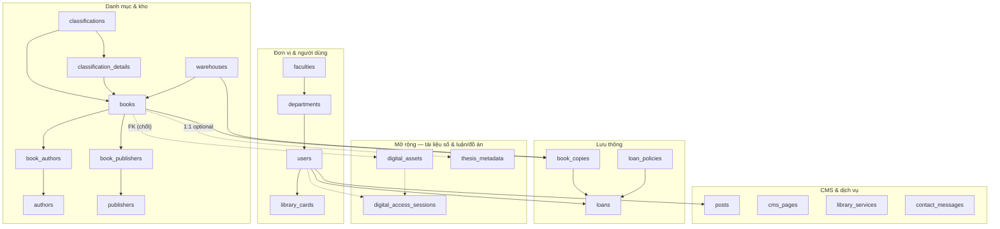
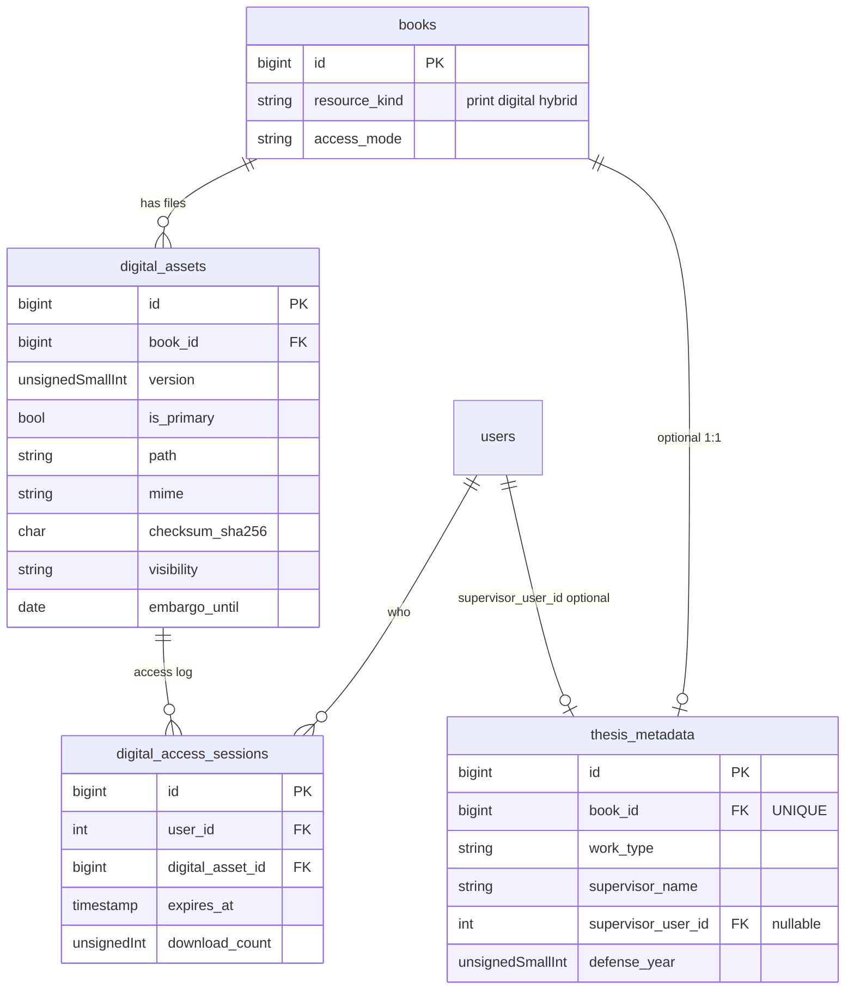

# ERD — UTC-eLibrary (chốt thiết kế)

Tài liệu này **chốt** mô hình quan hệ: (1) **hiện trạng** theo migrations trong repo; (2) **mở rộng** cho tài liệu số PDF, đồ án / NC — dùng chung catalog `books`, tách bảng file và metadata học thuật.

---

## 1. Sơ đồ tổng quan (hiện trạng + mở rộng)



---

## 2. ERD chi tiết — hiện trạng (MySQL / Laravel)

> **Quy ước:** `PK` = khóa chính, `FK` = khóa ngoại, `UQ` = unique. Nhiều bảng có `params` JSON, `timestamps`, `created_by` / `updated_by` / `deleted_by` → `users.id` (audit).

### 2.1 Đơn vị trường & người dùng

```mermaid
erDiagram
  faculties ||--o{ departments : "has"
  faculties ||--o{ users : "faculty_id"
  departments ||--o{ users : "department_id"

  faculties {
    int id PK "increments"
    string code UK
    string name
    bool is_active
    json params
    timestamps
  }

  departments {
    int id PK "increments"
    int faculty_id FK
    string code UK
    string name
    bool is_active
    json params
    timestamps
  }

  users {
    int id PK "increments"
    string code UK
    string name
    string email UK
    string password
    string phone "nullable UK"
    string user_type "MEMBER LIBRARIAN…"
    string cohort "K60…"
    int faculty_id FK "nullable"
    int department_id FK "nullable"
    bool is_active
    timestamps
    soft_deletes
    int created_by FK "nullable users"
    int updated_by FK "nullable"
    int deleted_by FK "nullable"
  }

  library_cards {
    bigint id PK
    int user_id FK
    string card_number UK
    string status
    bool is_active
    date issue_date
    date expiry_date
    json metadata
    timestamps
  }

  users ||--o{ library_cards : "has"
```

### 2.2 Phân loại, kho, đầu sách

```mermaid
erDiagram
  classifications ||--o{ classifications : "parent_id self"
  classifications ||--o{ classification_details : "has"
  classification_details ||--o{ classification_details : "parent_id self"
  classifications ||--o{ books : "classification_id"
  classification_details ||--o{ books : "classification_detail_id"
  warehouses ||--o{ warehouses : "parent_id self"
  warehouses ||--o{ books : "warehouse_id"
  warehouses ||--o{ book_copies : "warehouse_id"

  books ||--o{ book_authors : "M:N"
  authors ||--o{ book_authors : "M:N"
  books ||--o{ book_publishers : "M:N"
  publishers ||--o{ book_publishers : "M:N"

  classifications {
    bigint id PK
    string code UK
    string name
    bigint parent_id FK "nullable self"
    json params
    timestamps
  }

  classification_details {
    bigint id PK
    string code UK
    string name
    bigint classification_id FK
    bigint parent_id FK "nullable self"
    json params
    timestamps
  }

  warehouses {
    bigint id PK
    string code UK
    string name
    bigint parent_id FK "nullable self"
    bool is_active
    json params
    timestamps
    soft_deletes
  }

  books {
    bigint id PK
    string registration_number "nullable UQ"
    string book_code
    string title
    string sub_title
    string language
    unsignedSmallInt published_year
    unsignedInt quantity
    bigint classification_id FK
    bigint classification_detail_id FK
    bigint warehouse_id FK
    json params
    timestamps
    soft_deletes
  }

  authors {
    bigint id PK
    string name
    string slug UK
    json params
    timestamps
  }

  publishers {
    bigint id PK
    json params
    timestamps
  }

  book_authors {
    bigint id PK
    bigint book_id FK
    bigint author_id FK
    smallInt order
    UK "book_id author_id"
  }

  book_publishers {
    bigint id PK
    bigint book_id FK
    bigint publisher_id FK
    smallInt order
    UK "book_id publisher_id"
  }
```

### 2.3 Bản cứng & mượn trả

```mermaid
erDiagram
  books ||--|{ book_copies : "has"
  book_copies ||--o{ loans : "M:1 active loan typical"
  users ||--o{ loans : "borrower"
  users ||--o{ loans : "librarian_id"
  loan_policies ||--o{ loans : "loan_policy_id"

  book_copies {
    bigint id PK
    bigint book_id FK
    string barcode "nullable UQ"
    string call_number
    string status "available…"
    bigint warehouse_id FK
    string location
    json params
    timestamps
    soft_deletes
  }

  loan_policies {
    bigint id PK
    string code UK
    string name
    string user_type
    unsignedInt max_books
    unsignedInt max_days
    unsignedTinyInt max_renewals
    decimal overdue_fine_per_day
    bool allow_home
    bool allow_onsite
    json params
    timestamps
  }

  loans {
    bigint id PK
    int user_id FK
    bigint book_copy_id FK
    bigint loan_policy_id FK
    int librarian_id FK "nullable users"
    date loan_date
    date due_date
    date return_date
    string status
    unsignedTinyInt renewal_count
    json params
    timestamps
    soft_deletes
  }
```

### 2.4 CMS & hỗ trợ

```mermaid
erDiagram
  users ||--o{ posts : "author_id nullable"

  posts {
    bigint id PK
    string slug UK
    string title
    string type
    bool is_published
    int author_id FK "nullable users"
    json params
    timestamps
  }

  cms_pages {
    bigint id PK
    string slug UK
    string title
    string type
    bool is_published
    json params
    timestamps
  }

  library_services {
    bigint id PK
    string code UK
    string name
    bool is_active
    json params
    timestamps
  }

  contact_messages {
    bigint id PK
    string status
    int handled_by FK "nullable users"
    timestamp handled_at
    json params
    timestamps
  }
```

### 2.5 Spatie Permission (cấu hình `config/permission.php`)

Không vẽ đủ từng cột ở đây; thực tế gồm các bảng kiểu: `permissions`, `roles`, `model_has_permissions`, `model_has_roles`, `role_has_permissions` — liên kết **polymorphic** tới `users` (và model khác nếu có).

### 2.6 Bảng hạ tầng / khác

| Bảng | Ghi chú |
|------|---------|
| `periods` | Niên học / kỳ (code, start/end) — multi-tenant theo app nếu dùng |
| `customers` | Legacy / tách domain — không gắn FK chặt với thư viện trong ERD này |
| `email_otp` | OTP |
| `personal_access_tokens` | Sanctum/API token |
| `cache`, `jobs`, `sessions` | Laravel |

---

## 3. ERD — phần mở rộng đã **chốt** (triển khai bằng migration sau)

Nguyên tắc: **một đầu mục catalog = một dòng `books`**. Loại tài liệu phân biệt bằng cột; file PDF và metadata luận/đồ án **tách bảng** — dễ truy vấn, index, debug.

### 3.1 Cột bổ sung cho `books` (cùng bảng hiện có)

| Cột | Kiểu | Mô tả |
|-----|------|--------|
| `resource_kind` | `string(20)` hoặc enum | `print` \| `digital` \| `hybrid` |
| `access_mode` | `string(20)` | `circulation_only` \| `online_only` \| `both` (tuỳ nghiệp vụ) |

*Index gợi ý:* `(resource_kind, classification_id)`, `(resource_kind, warehouse_id)` nếu filter thường xuyên.

### 3.2 Bảng `digital_assets` (1 đầu sách — nhiều file / phiên bản)

| Cột | Kiểu |
|-----|------|
| `id` | PK bigint |
| `book_id` | FK → `books.id` CASCADE |
| `version` | unsignedSmallInt, default 1 |
| `is_primary` | bool |
| `storage_disk` | string |
| `path` | string (path hoặc object key) |
| `original_name` | string nullable |
| `mime` | string(100) |
| `byte_size` | unsignedBigInt nullable |
| `checksum_sha256` | char(64) nullable, index |
| `visibility` | string(20) — ví dụ `public`, `internal`, `restricted` |
| `embargo_until` | date nullable |
| `params` | json nullable |
| timestamps + audit (theo chuẩn dự án) |

*Index:* `(book_id, is_primary)`, `(book_id, version DESC)`.

### 3.3 Bảng `thesis_metadata` (1–1 với `books` khi là luận/đồ án/NC)

| Cột | Kiểu |
|-----|------|
| `id` | PK bigint |
| `book_id` | FK → `books.id` CASCADE **UNIQUE** |
| `work_type` | string(30) — ví dụ `undergraduate_thesis`, `master_thesis`, `doctor_thesis`, `research_project` |
| `degree_program` | string(100) nullable — gợi ý gắn sau với bảng `programs` nếu có |
| `supervisor_name` | string nullable |
| `supervisor_user_id` | unsignedInt nullable FK → `users.id` |
| `defense_year` | unsignedSmallInt nullable |
| `keywords` | text nullable hoặc bảng tag sau này |
| `abstract_text` | text nullable *(nếu không lưu hết trong `books.summary`)* |
| `params` | json nullable |
| timestamps |

### 3.4 Bảng `digital_access_sessions` (tách khỏi `loans` — truy cập số)

Dùng khi cần giới hạn xem/tải theo thời gian hoặc số lần; **không** dùng `book_copy_id` giả.

| Cột | Kiểu |
|-----|------|
| `id` | PK bigint |
| `user_id` | FK → `users.id` |
| `digital_asset_id` | FK → `digital_assets.id` CASCADE |
| `granted_at` | timestamp |
| `expires_at` | timestamp nullable |
| `download_count` | unsignedInt default 0 |
| `max_downloads` | unsignedInt nullable |
| `params` | json nullable |
| timestamps |

*Index:* `(user_id, digital_asset_id)`, `(expires_at)`.

### 3.5 Sơ đồ quan hệ mở rộng



---

## 4. Quy tắc nghiệp vụ ngắn (để code & DB thống nhất)

1. **`resource_kind = print`** — luồng chính: `book_copies` + `loans` như hiện tại.
2. **`resource_kind = digital`** — bắt buộc có ít nhất một `digital_assets` khi `access_mode` cho phép online; không bắt buộc `book_copies` trừ khi có bản in kèm (`hybrid`).
3. **`thesis_metadata`** — chỉ tạo khi `work_type` thuộc nhóm luận/đồ án/NC; `book_id` unique để tránh trùng.
4. **Full-text PDF** — không lưu nội dung extract trong `books`; dùng bảng search/chunk hoặc engine tìm kiếm riêng (bổ sung sau, không đổi ERD lõi).

---

## 5. File liên quan trong repo

- Migrations hiện tại: `database/migrations/`
- **Đã triển khai:** `2026_03_21_120000_add_digital_library_tables.php` — cột `resource_kind` / `access_mode` trên `books`, bảng `digital_assets`, `thesis_metadata`, `digital_access_sessions`.
- Models: `DigitalAsset`, `ThesisMetadata`, `DigitalAccessSession`; enum `ResourceKind`, `AccessMode`; API upload PDF: `POST /api/v1/books/{book}/digital-assets`, xóa: `DELETE .../digital-assets/{digital_asset}`.

---

*UTC-eLibrary — ERD chốt cho mô hình thư viện đại học + tài liệu số.*
