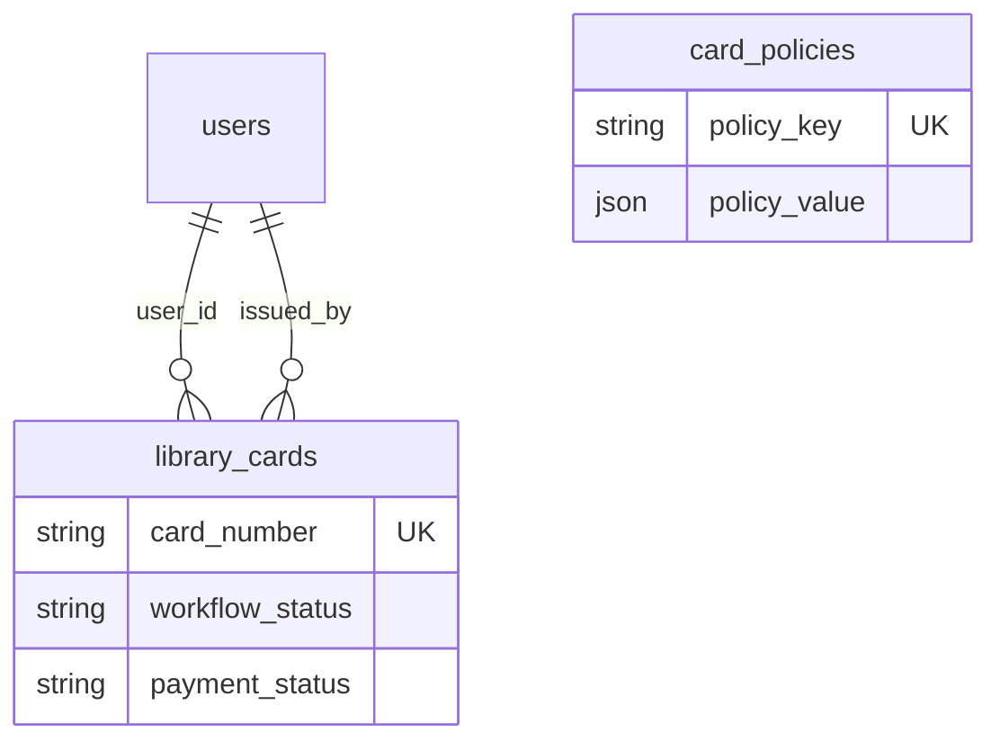
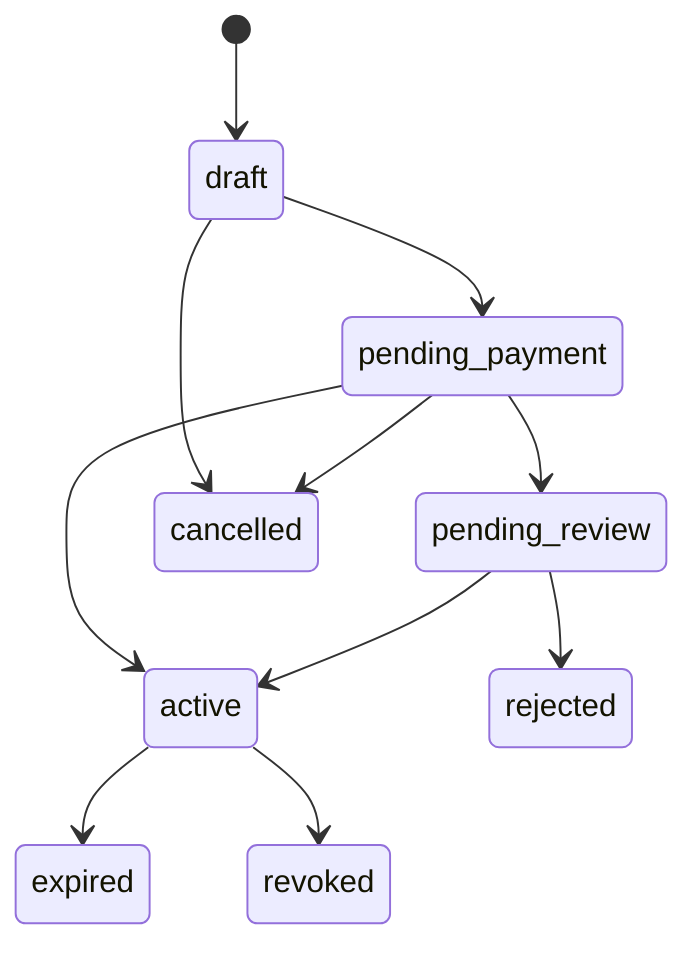

# Luồng thẻ thư viện & API (tham chiếu)

Thiết kế hiện tại: **một bảng chính `library_cards`** + **cấu hình `card_policies`**.  
Các bảng `card_applications` / `card_payments` đã **gỡ khỏi schema** (migration drop + xóa file/model cũ).

Route API: chưa gắn trong `routes/api.php` — bảng dưới đây là **đề xuất** khi triển khai.

---

## 1. Quan hệ còn lại

`card_policies` là bảng cấu hình (`policy_key` / `policy_value`); ứng dụng **đọc theo key** — không bắt buộc FK từ `library_cards`.

---

## 2. `workflow_status` (trên `library_cards`)

Hằng số trong code: [app/Models/LibraryCard.php](app/Models/LibraryCard.php).

---

## 3. Luồng nghiệp vụ tổng quát

---

## 4. API đề xuất (gom trên `library_cards`)

| Nhóm | Method | URL đề xuất | Ghi chú |
|------|--------|-------------|---------|
| Member | GET | `/api/v1/me/library-card` | Thẻ của user đăng nhập |
| Member | POST | `/api/v1/me/library-card` | Tạo bản ghi nháp / cập nhật thông tin (workflow `draft` → …) |
| Member | POST | `/api/v1/me/library-card/submit` | Nộp (`submitted_at`, chuyển bước workflow) |
| Admin | GET | `/api/v1/card-policies` | `card_policies` |
| Admin | PUT/PATCH | `/api/v1/card-policies/{id}` | Sửa policy |
| Admin | GET | `/api/v1/library-cards` | Danh sách + filter `workflow_status` |
| Admin | GET | `/api/v1/library-cards/{id}` | Chi tiết |
| Admin | PATCH | `/api/v1/library-cards/{id}` | Duyệt, ghi nhận thanh toán, kích hoạt, khóa… |

---

## 5. File liên quan trong repo

| Thành phần | Đường dẫn |
|------------|-----------|
| Bảng thẻ (workflow + payment + status) | [database/migrations/2026_03_12_101300_create_library_cards_table.php](database/migrations/2026_03_12_101300_create_library_cards_table.php) |
| Policy | [database/migrations/2026_03_30_093000_create_card_policies_table.php](database/migrations/2026_03_30_093000_create_card_policies_table.php) |
| Model | [app/Models/LibraryCard.php](app/Models/LibraryCard.php), [app/Models/CardPolicy.php](app/Models/CardPolicy.php) |
| Resource | [app/Http/Resources/LibraryCardResource.php](app/Http/Resources/LibraryCardResource.php) |
| Service | [app/Services/LibraryCardService.php](app/Services/LibraryCardService.php) |

---

## 6. Ghi chú

- `card_number` unique: khi `draft`, service gán mã tạm (ví dụ `DRAFT-…`), khi `active` đổi mã chính thức.
- Render Mermaid: VS Code preview hoặc [mermaid.live](https://mermaid.live).

---

Xem thêm: [docs/README.md](README.md) · ERD tổng thể: [ERD.md](ERD.md).
